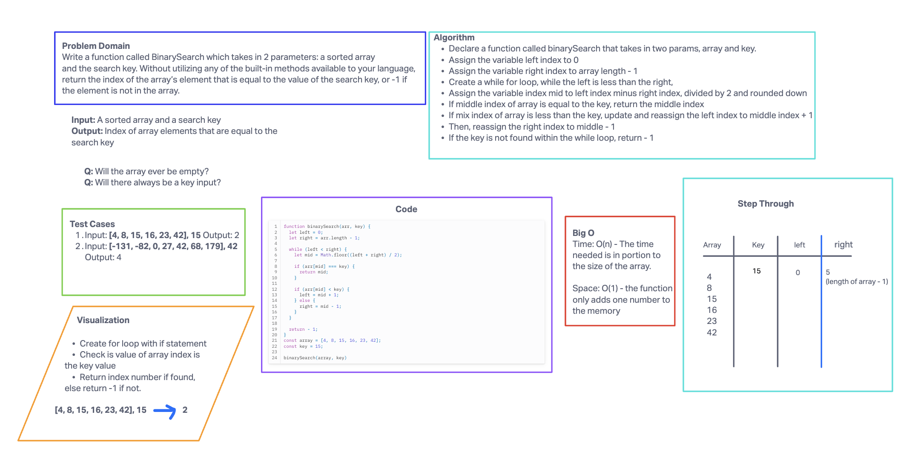

# Code challenge 3

## Challenge Title

Write a function called BinarySearch which takes in 2 parameters: a sorted array and the search key. Without utilizing any of the built-in methods available to your language, return the index of the array’s element that is equal to the value of the search key, or -1 if the element is not in the array.

## Whiteboard process

## Approach and Efficiency

The results I got for the big O is the time being O(n), the time needed is in portion to the size of the array. The space would be O(1), the function only adds one number to the memory.

With my algorithm, the while loop runs only once because the key is found at the midpoint. In other cases, when the key is not at the midpoint, the loop will continue to divide the search space in half until the key is found or the search space is empty.

## Collaborators

Josh and I worked together to complete this code challenge
