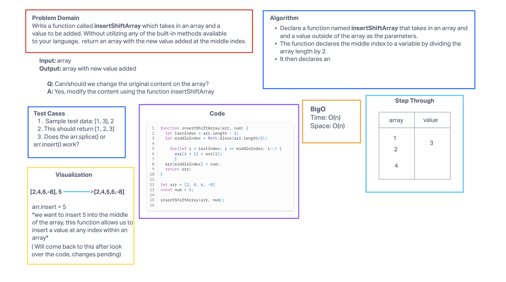

# Code challenge 1

## Challenge Title

Write a function called insertShiftArray which takes in an array and a value to be added. Without utilizing any of the built-in methods available to your language, return an array with the new value added at the middle index.

## Whiteboard process

## Approach and Efficiency

Modified array in place

Assigned partner wasn't available, collaborated with Tim and Emmanuel on this whiteboard.
