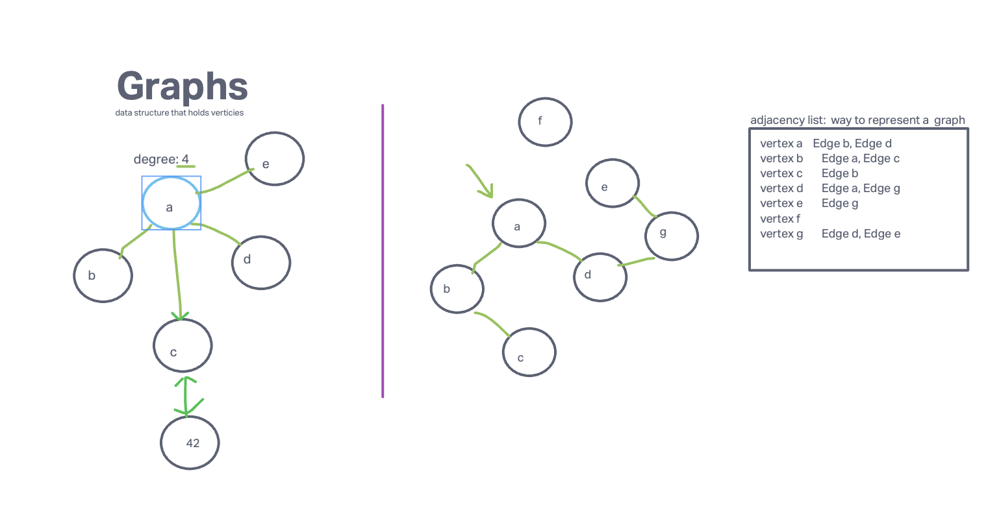
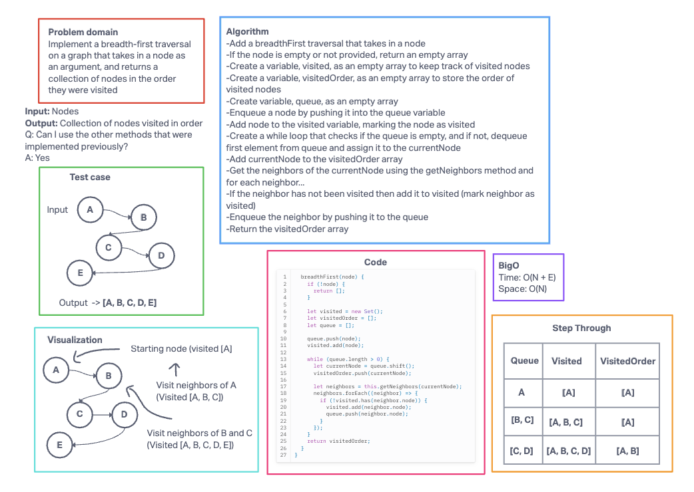
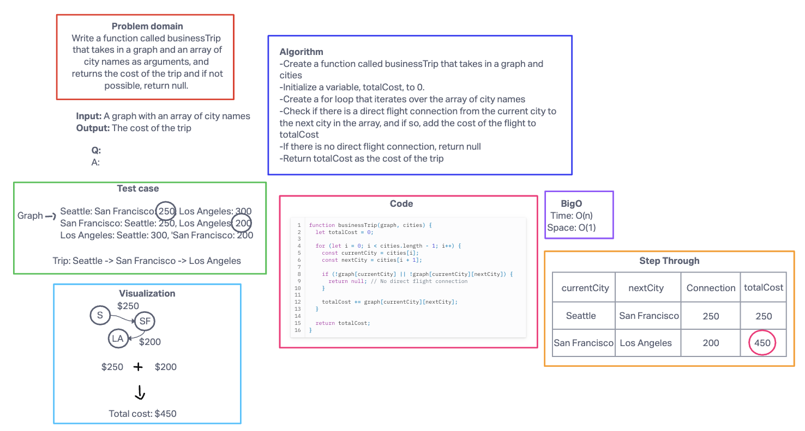
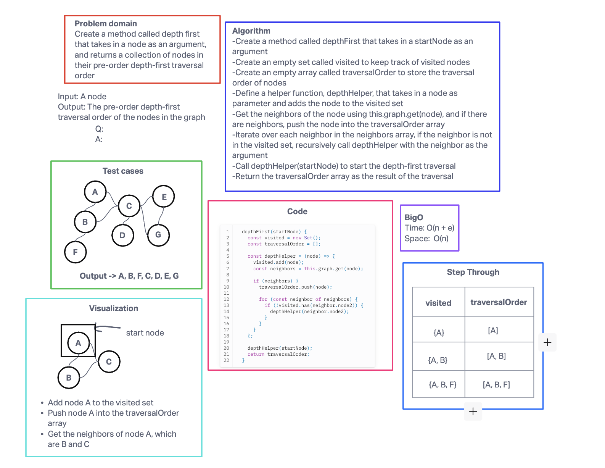

# Code challenge 35-37

## Challenge Title

Graphs

### Features

- Challenge 35

Implement your own Graph. The graph should be represented as an adjacency list, and should include the following methods:

- add node
  - Arguments: value
  - Returns: The added node
  - Add a node to the graph

- add edge
  - Arguments: 2 nodes to be connected by the edge, weight (optional)
  - Returns: nothing
  - Adds a new edge between two nodes in the graph
  - If specified, assign a weight to the edge
  - Both nodes should already be in the Graph

- get nodes
  - Arguments: none
  - Returns all of the nodes in the graph as a collection (set, list, or similar)
  - Empty collection returned if there are no nodes

- get neighbors
  - Arguments: node
  - Returns a collection of edges connected to the given node
  - Include the weight of the connection in the returned collection
  - Empty collection returned if there are no nodes

- size
  - Arguments: none
  - Returns the total number of nodes in the graph
  - 0 if there are none

- Challenge 36

- Challenge 37

Write a function called business trip
Arguments: graph, array of city names
Return: the cost of the trip (if it’s possible) or null (if not)
Determine whether the trip is possible with direct flights, and how much it would cost.

- Challenge 38

Write a method for the Graph class that is called depthFirst, that takes in a node as an argument and returns a collection of nodes in their pre-order depth-first traversal order.

### Structure and Testing

Write tests to prove the following functionality:

- Node can be successfully added to the graph

- An edge can be successfully added to the graph
- A collection of all nodes can be properly retrieved from the graph
- All appropriate neighbors can be retrieved from the graph
- Neighbors are returned with the weight between nodes included
- The proper size is returned, representing the number of nodes in the graph
- A graph with only one node and edge can be properly returned

You can also just write at least three test assertions for each method that you define.

## Whiteboard process

Code Challenge 35

Code Challenge 36

Code Challenge 37

Code Challenge 38

## Approach and Efficiency

My BigO

Challenge 35

Time: O(1) for most operations, except for getNodes() which is O(n)
Space: O(n)
 
 

Challenge 36

Time: O(n + e) -> (Can also use V to represent vertices (nodes), and e represents the number of edges)
Space: O(n)
 
 

Challenge 37

Time: O(n)
Space: O(1)

Challenge 38

Time: O(n + e)
Space: O(n)

## Collaborators

- Challenge 35 - Ryan graph data structure demo and chatgpt to help fix tests that weren't passing due to some of my code that needed to be edited.
- Challenge 36 - Documentation about graphs and breadthFirst, and Chat gpt to help write tests.
- Challenge 37 and 38 - Used chatgpt to help with tests and debugging code

## Links and Resources

[Loop graph theory](https://en.wikipedia.org/wiki/Loop_(graph_theory))

[Breadth First - Geeks for Geeks](https://www.geeksforgeeks.org/breadth-first-search-or-bfs-for-a-graph/)
