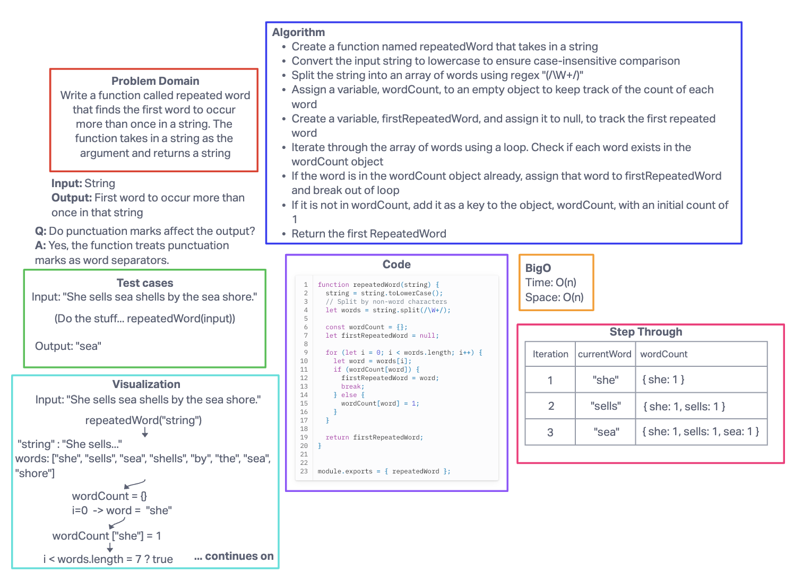

# Code challenge 31

## Challenge Title

### Feature Tasks

Write a function called repeated word that finds the first word to occur more than once in a string

Arguments: string

Return: string

### Structure and Testing

Write at least three test assertions for each method that you define.

Ensure your tests are passing before you submit your solution.

## Whiteboard process

## Approach and Efficiency

My BigO:

hashmap
Time: O(n)
Space: O(n)

## Collaborators

Used chatGPT to help fix some issues I was having
