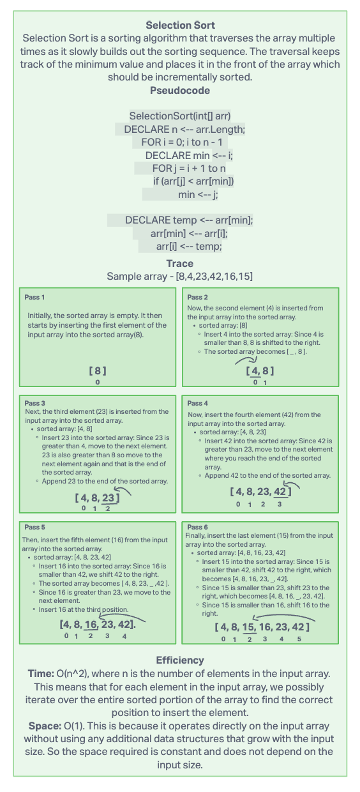
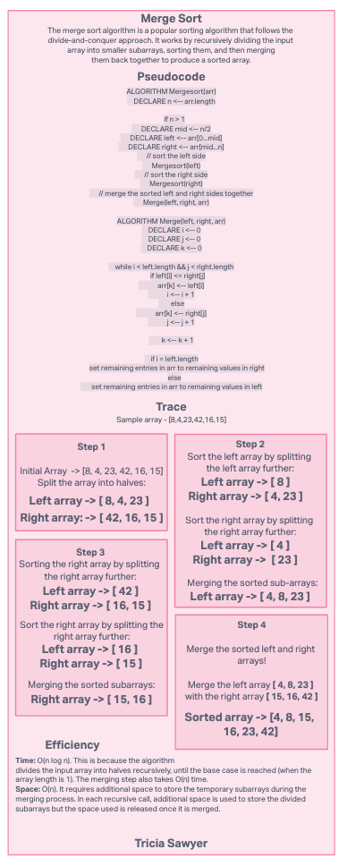

# Code challenge 26-27

## Challenge Title

Review the pseudocode below, then trace the algorithm by stepping through the process with the provided sample array. Document your explanation by creating a blog article that shows the step-by-step output after each iteration through some sort of visual.
Once you are done with your article, code a working, tested implementation for each challenge based on the pseudocode provided.

## Whiteboard process

## Approach and Efficiency

My BigO:

Insertion
Time: O(n^2)
Space: O(n), since initialized as empty array

Merge
Time: O(n log n)
Space: O(n)

## Collaborators

I referenced chat gpt for editing my code solution and how the tests would look.
