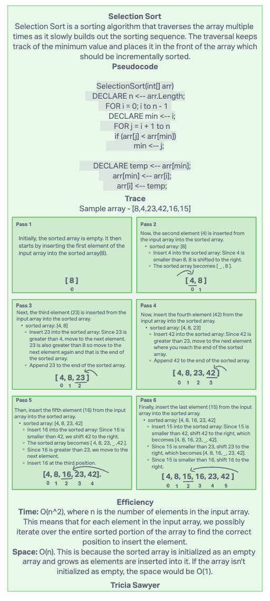

# Code challenge 26

## Challenge Title

- Challenge 26 - Review the pseudocode below, then trace the algorithm by stepping through the process with the provided sample array. Document your explanation by creating a blog article that shows the step-by-step output after each iteration through some sort of visual.
Once you are done with your article, code a working, tested implementation of Insertion Sort based on the pseudocode provided.

## Whiteboard process

## Approach and Efficiency

My BigO:

Insertion
Time: O(n^2)
Space: O(1)

## Collaborators
