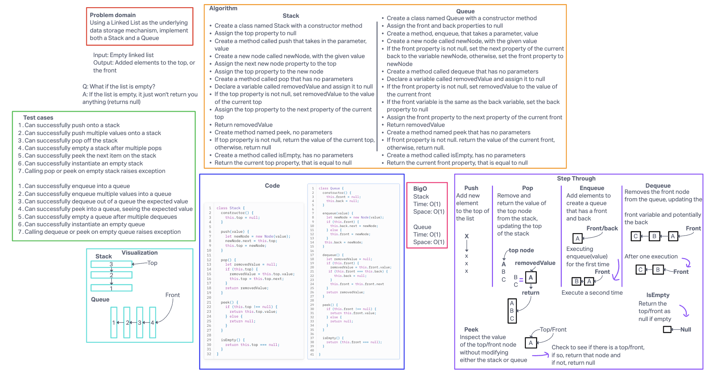

# Code challenge 10

## Challenge Title

Using a Linked List as the underlying data storage mechanism, implement both a Stack and a Queue.

## Whiteboard process

## Approach and Efficiency

My BigO:

Stack
time: O(1)
space: O(1)

Queue
time: O(1)
space: O(1)

## Collaborators

Worked on this with Ryan in lecture.

## Solution
