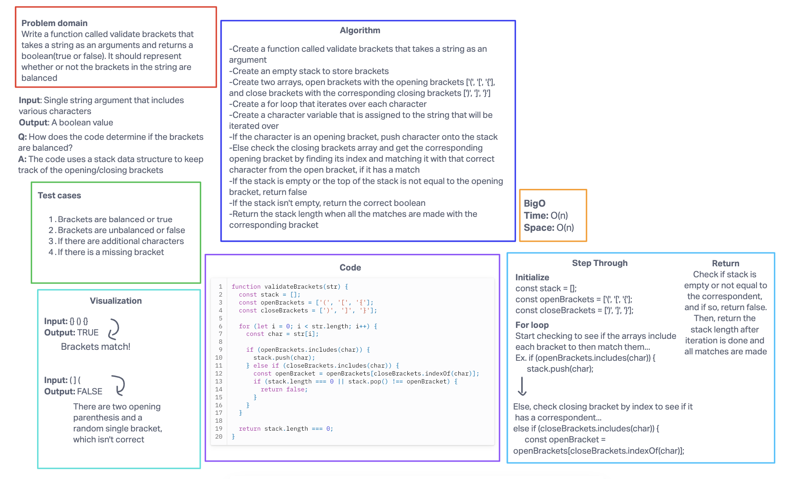

# Code challenge 10-12

## Challenge Title

- Challenge 10 - Using a Linked List as the underlying data storage mechanism, implement both a Stack and a Queue.
- Challenge 11 - Create a new class called pseudo queue that utilizes 2 stack methods, enqueue and dequeue, to create and manage the queue.
- Challenge 12 - Create a class called AnimalShelter which holds only dogs and cats.
The shelter operates using a first-in, first-out approach. Implement the 2 stack methods, enqueue and dequeue.
- Challenge 13 - Write a function called validate brackets that takes a string as an arguments and returns a boolean(true or false). It should represent whether or not the brackets in the string are balanced.

## Whiteboard process

## Approach and Efficiency

My BigO:

Stack
Time: O(1)
Space: O(1)

Queue
Time: O(1)
Space: O(1)

PseudoQueue
Time: O(n) -> enqueue
Time: O(1) -> dequeue
Space: O(n)

AnimalShelter
Time: O(1)
Space: O(1)

validateBrackets
Time: O(n)
Space: O(n)

## Collaborators

- Worked on code challenge 10 with Ryan in lecture.
- Code challenge 11 was just me, due to unavailability
- Assigned partner wasn't available for code challenge 12
- Wasn't available for partnering
