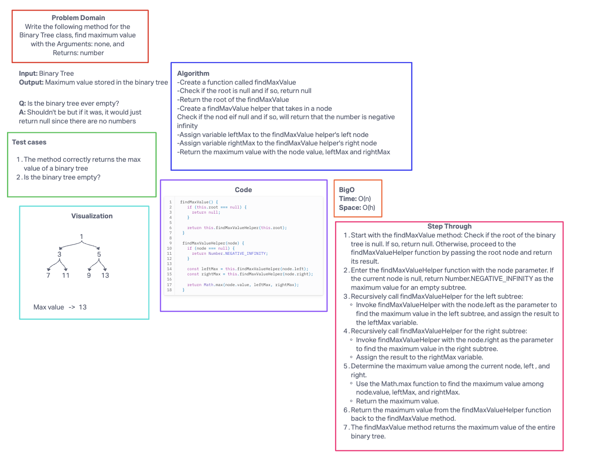
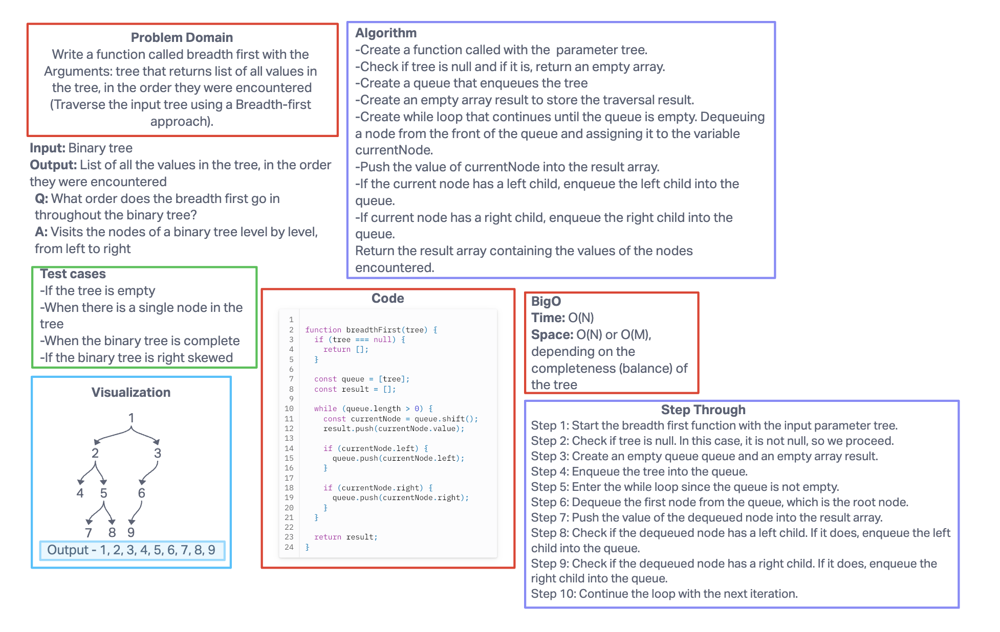

# Code challenge 15-16

## Challenge Title

Features lab 15:
Node: Create a Node class that has properties for the value stored in the node, the left child node, and the right child node.
Binary Tree: Create a Binary Tree class and define a method for each of the depth first traversals:

- pre order
- in order
- post order

Each depth first traversal method should return an array of values, ordered appropriately.
Binary Search Tree: Create a Binary Search Tree class. This class should be a sub-class (or your languages equivalent) of the Binary Tree Class, with the following additional methods:
Add: Arguments: value, Return: nothing, Adds a new node with that value in the correct location in the binary search tree.

Contains: Argument: value, Returns: boolean indicating whether or not the value is in the tree at least once.

Features lab 16:
Write the following method for the Binary Tree class

find maximum value
Arguments: none
Returns: number
Find the maximum value stored in the tree. You can assume that the values stored in the Binary Tree will be numeric.

## Whiteboard process

## Approach and Efficiency

My BigO for each challenge within this :

Trees
Time: O(n) for traversals, O(h) for add() and contains()
Space: O(n) for traversals, O(h) for add() and contains()

KaryTrees
Time: Add method is O(k) worst case, contains method is O(n)
Space: Add method is O(1), contains method is O(h)

findMaxValue
Time: O(n)
Space: O(n)

breadthFirst
Time: O(n)
Space: O(n), or O(m) depending on how balanced or complete the tree is.

## Collaborators

Used chatgtp to help me with the step through for code challenge 15, and just reworded it to help my understanding of the trees in general.
